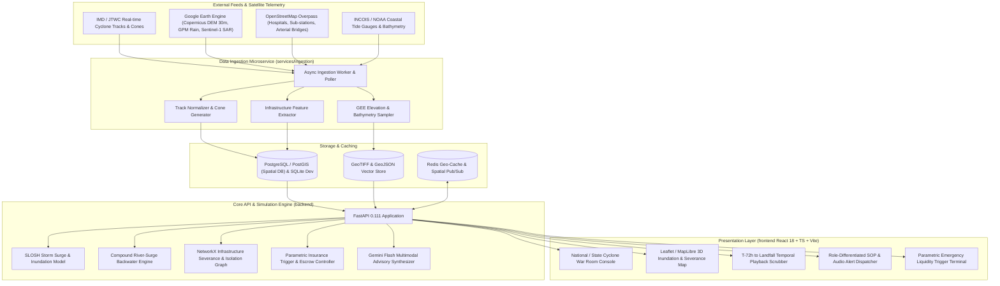

# प्रहार (PRAHAR)
### *Predictive Risk & Anticipatory Hazard Action Resource for Cyclone Impact & Infrastructure Vulnerability across the Bay of Bengal & Coastal APAC*

[](https://python.org)
[](https://fastapi.tiangolo.com)
[](https://react.dev)
[](https://typescriptlang.org)
[](https://ai.google.dev/)
[](https://earthengine.google.com/)
[](https://leafletjs.com)

---

## 🌊 Indic Concept & Mission

**प्रहार (PRAHAR)** brings together two profound Indic meanings:
- **प्रहर (Prahar / Vigilant Watch)**: The ancient Vedic division of time (each 3-hour watch of the day and night), symbolizing unyielding, round-the-clock surveillance and early warning over turbulent seas.
- **प्रहार (Prahar / Proactive Strike)**: A decisive, anticipatory counter-action against impending disaster. Instead of waiting for a cyclone to strike coastlines and responding reactively with post-disaster body recovery and reconstruction, **PRAHAR** mounts a pre-emptive strike: hardening power grids, evacuating vulnerable wards through verified corridors, and releasing emergency insurance liquidity 48 hours *before* landfall.

---

## 🎯 Hackathon Evaluation Alignment

| Weight | Parameter | How PRAHAR Delivers |
| :--- | :--- | :--- |
| **20%** | **Problem-Solution Fit** | Directly tackles the world's deadliest cyclone basin (Bay of Bengal). Solves the fatal gap between broad meteorological forecasts (e.g. "heavy rain and 120 km/h winds") and granular ground-level operational risk (e.g., *which specific primary health center sub-stations will submerge 18 hours prior to landfall*). |
| **25%** | **AI / Technical Execution** | **1)** Google Earth Engine (GEE) integration for Copernicus GLO-30 DEM elevation gradients, Sentinel-1 SAR historical flood calibration, and GPM precipitation; **2)** SLOSH-based hydrodynamic storm surge & compound backwater simulation; **3)** NetworkX infrastructure exposure & road severance graph analysis; **4)** Gemini Flash multimodal reasoning synthesizing spatial GIS overlays into role-specific Standard Operating Procedures (SOPs). |
| **20%** | **Depth & Reach Across Coastal APAC** | Spans high-risk vulnerable coastlines across Odisha, West Bengal, Andhra Pradesh, Tamil Nadu, Bangladesh (Sundarbans & Chittagong), and Myanmar (Rakhine/Ayeyarwady). Supports hyper-local multilingual alerts in Odia, Bengali, Telugu, Tamil, Burmese, and Hindi. |
| **15%** | **Impact Potential** | Transforms disaster economics: shifting capital from post-disaster compensation to pre-landfall anticipatory action saves an estimated 4:1 to 7:1 in disaster response expenditures, protects critical hospital power grids, and preserves coastal livelihoods through automated parametric insurance liquidity. |
| **20%** | **Deployability & Scalability** | Decoupled microservice architecture with a dedicated real-time **Data Ingestion Service**, a high-performance **FastAPI Core Simulation Engine**, and a **React 18 + Leaflet/MapLibre** command deck. Complete with `./setup.sh`, Docker Compose, and zero-dependency offline mock fallbacks for all APIs. |

---

## 🏗️ System Architecture



---

## ⚡ Core Features & Innovations

### 1. 🌊 Compound Hydrodynamic Storm Surge & Elevation Simulator
Traditional models predict coastal water levels in isolation. **PRAHAR** couples bathymetry-sloped wind setup and atmospheric pressure drop ($\Delta P$) with high-resolution **Google Earth Engine Copernicus GLO-30 DEM** data. It simulates compound inundation where storm surges bottle up swollen river mouths, calculating hyper-local flood depths (0.5m to >4.0m) across inland Gram Panchayats.

### 2. 📡 Dedicated Asynchronous Data Ingestion Microservice (`services/ingestion`)
Separated from the user-facing REST API, this dedicated background service continuously polls:
- Live cyclone bulletin feeds from IMD and JTWC Automated Tropical Cyclone Forecast (ATCF) streams.
- GEE satellite raster collections (Sentinel-1 SAR backscatter for historical calibration, GPM precipitation).
- OpenStreetMap Overpass spatial queries for critical lifeline infrastructure across coastal districts.
- INCOIS real-time coastal tide station telemetry.

### 3. 🏥 Critical Infrastructure Exposure & Isolation Graph
Models road networks, coastal bridges, electrical sub-stations, and medical facilities as a directed spatial graph using NetworkX. 
- Road segments inundated by $>0.5\text{m}$ water are dynamically severed.
- Automatically calculates the **Infrastructure Isolation Index**: identifying Primary Health Centres (PHCs) and cyclone shelters that will become physically unreachable before landfall.

### 4. 🧠 Gemini Flash Multimodal Reasoning & Multi-Tier SOP Synthesizer
Feeds composite GIS risk maps, elevation profiles, and infrastructure exposure tables to **Gemini Flash** to generate zero-latency, role-differentiated emergency directives:
- **NDRF / Armed Forces**: Boat-staging coordinates, helicopter landing zone safety checks, and generator mobilization targets.
- **District Magistrates & Collectors**: Gram Panchayat evacuation quotas, priority shelters, and de-watering pump allocations.
- **Coastal Communities**: Clear, hyper-local voice bulletins broadcast in Odia, Bengali, Telugu, and Hindi via Cloud Text-to-Speech.

### 5. 💳 Pre-Landfall Parametric Insurance Liquidity Smart Escrow
Removes months of red-tape and bureaucratic post-disaster loss assessments. Based on pre-agreed verifiable indices (e.g., *Sustained wind speed $\ge 120\text{ km/h}$ AND surge depth $\ge 1.5\text{m}$ within $25\text{km}$ radius*), the platform automatically unlocks emergency contingency funds 24–48 hours *before* landfall to fund evacuation buses, diesel for hospital generators, and emergency food caches.

---

## 🗂️ Repository Structure

```text
PRAHAR/
├── .agent/
│   └── skills/
│       └── prahar-cyclone-resilience/
│           └── SKILL.md            # Agent skill & architectural guidelines
├── services/
│   └── ingestion/                  # Dedicated Data Ingestion Microservice
│       ├── app/
│       │   ├── collectors/         # IMD, JTWC, GEE, OSM, and Tide pollers
│       │   ├── processors/         # GeoJSON normalizers & raster extractors
│       │   ├── core/               # Ingestion configs & scheduling
│       │   └── main.py             # Microservice entrypoint
│       ├── requirements.txt
│       └── Dockerfile
├── backend/                        # Core API & Predictive Simulation Engine
│   ├── app/
│   │   ├── api/v1/                 # Endpoints: cyclones, simulation, vulnerability, gemini, parametric
│   │   ├── core/                   # App config, database, GEE credentials, Gemini client
│   │   ├── db/                     # Models, schemas, spatial migrations
│   │   ├── services/
│   │   │   ├── surge_simulation.py # SLOSH & hydrodynamic inundation model
│   │   │   ├── graph_analyzer.py   # NetworkX road severance & isolation graph
│   │   │   ├── gemini_advisor.py   # Multimodal reasoning & SOP generation
│   │   │   └── parametric.py       # Smart escrow trigger verification
│   │   ├── data/seeds/             # Historical storms (Amphan, Fani, Mocha, Dana) & OSM seeds
│   │   └── main.py                 # FastAPI application
│   ├── tests/
│   ├── requirements.txt
│   └── Dockerfile
├── frontend/                       # Vite + React 18 + TypeScript Presentation Tier
│   ├── src/
│   │   ├── components/             # 3D Map, Timeline Scrubber, SOP Drawer, Escrow Desk
│   │   ├── hooks/                  # API data fetching & WebSocket streaming
│   │   ├── types/                  # TypeScript interface definitions
│   │   └── App.tsx
│   ├── package.json
│   └── vite.config.ts
├── docker-compose.yml              # Multi-container orchestration (Ingestion + Backend + Frontend + Redis)
├── setup.sh                        # One-command automated local bootstrapping
└── README.md
```

---

## 🚀 Quick Start Guide

### Prerequisites
- Python 3.11 or 3.12
- Node.js 18+ and npm
- (Optional) `GEMINI_API_KEY` and Google Earth Engine Service Account (includes built-in realistic mock data for Cyclone Amphan, Fani, and Dana for instant evaluation without keys).

### Automated Setup
```bash
git clone https://github.com/chiraghs/PRAHAR.git
cd PRAHAR
chmod +x setup.sh
./setup.sh
```

### Manual Execution

#### Terminal 1 — Data Ingestion Microservice:
```bash
cd services/ingestion
python3 -m venv venv
source venv/bin/activate
pip install -r requirements.txt
python app/main.py
```

#### Terminal 2 — Backend Core Engine (FastAPI):
```bash
cd backend
python3 -m venv venv
source venv/bin/activate
pip install -r requirements.txt
python app/scripts/seed_cyclone_data.py
PYTHONPATH=. uvicorn app.main:app --reload --port 8000
```

#### Terminal 3 — Frontend (Vite + React + Leaflet):
```bash
cd frontend
npm install
npm run dev
```

Visit:
- **Interactive Command Deck**: `http://localhost:5173`
- **FastAPI Core Swagger Docs**: `http://localhost:8000/docs`
- **Ingestion Microservice Health**: `http://localhost:8001/health`
- **Prometheus Metrics**: `http://localhost:8000/metrics`

---

## 🧪 Testing

```bash
# Backend unit & simulation tests
cd backend
PYTHONPATH=. pytest tests/

# Ingestion service tests
cd ../services/ingestion
PYTHONPATH=. pytest tests/

# Frontend typecheck & build
cd ../frontend
npm run typecheck
npm run build
```

---

## 🛡️ License & Acknowledgments
Built with ❤️ for coastal resilience across the Bay of Bengal, adhering to architectural standards established in `smart-health` and `Civic-Pulse`.
